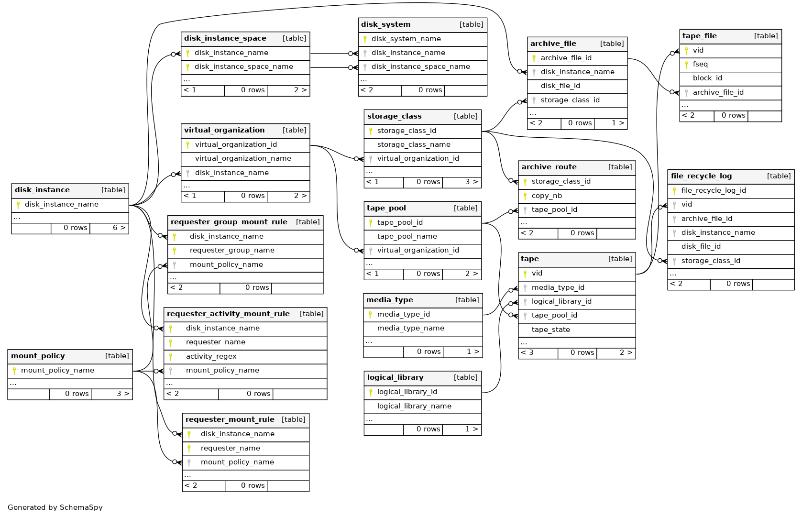

CTA Schema
==========

Here is CTA schema:

Unlike Enstore schema, the CTA db schema is more normalized and specifically
separates out the concepts of logical libraries, virtual organization, storage class into corresponding table. Therefore the names of ``virtual_organization``, ``logical_library`` and  ``storage_class`` have to be defined by admin in advance before any file can be written.

Additonally CTA has a concept of ``tape_pool`` that represents logical grouping
of tapes. Each tape belongs to exactly one tape pool. Tape pools are used to keep data belonging to different VOs, storage_class (via ``archive_route``).

The ``archive_route`` table connects ``storage_class`` to ``tape_pool`` and specifies how many copies a file must have.

File table
----------

CTA separates the concept of `file` into an abstract ``archive_file`` that may
have multiple corresponding ``tape_file`` entries. The ``archive_file`` table stores file size; adler32 checksum; dis instance name; ``disk_file_id`` - an inode number on storage front end; unique file id (``archive_file_id``); user UID/GID and a deleted flag.

A ``tape_file`` references ``archive_file`` and contains infromation that ties it to the tape - like volume id (``vid``); location on the tape and copy number.

Storage class table
-------------------

The storage class concept is somewhat similar to file family concept of Enstore. Besides unique name ``stotrage_class_name`` it specifies how many copes a file must have. And it has a reference to ``virtual_orhanization``.
