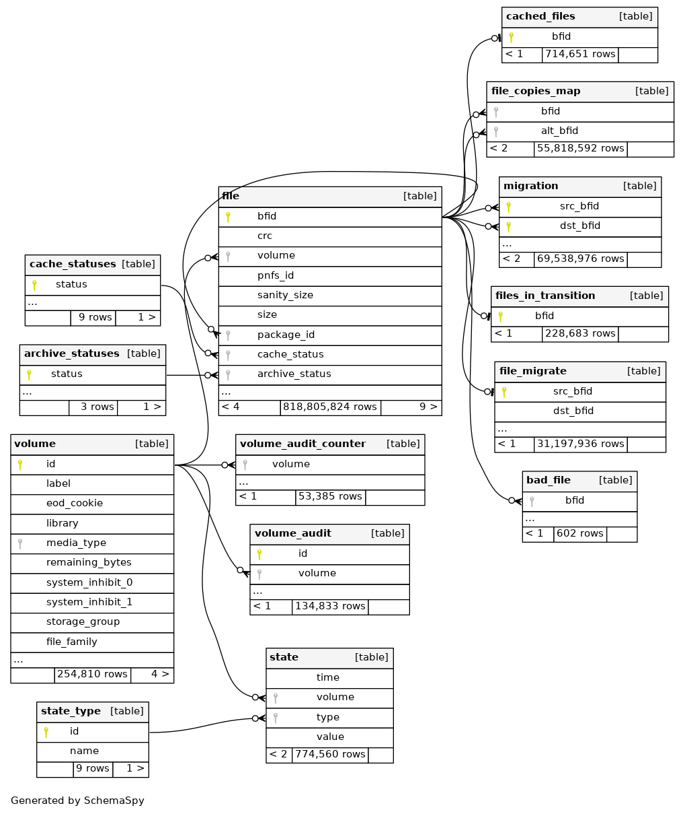

Enstore Schema
==============

Here is Enstore DB schema that does not contain "unattached"
tables like ``media_capacity``:

There are two main tables - ``file`` and ``volume`` and a bunch of ancillary
tables of which only ``file_copies_map`` is important for Enstore -> CTA transition. This table maps `primary` file copy and secondary file copies. In reality
Enstore uses maximum one extra copy of a file. Not all files have extra copies.

Each file copy in Enstore is uniquely identified by a BFID  -  bit file id,
which is a string obtained by adding a three letter `brand` (which is the same for all files in a given Enstore instance), the Unix epoch, multiplied by 100000 and a counter which is reserved to resolve collisions. BFID is generated in the code base and is iserted into ``file`` table where it has unique contraint. If insert file, the counter is incremented and the record insertion is tried again. And so on until it succeeds.

.. code-block:: python

    bfid = "CDMS" + str(time.time()*100000)

Each file record contains PNFSID (dCache inode identifier) that ties it back to
the front end storage system; adler32 checksum; a reference to the file package for small files in SFA (Small File Aggregation) equal BFID of the package or ``null`` for `direct` files; file size; original file name;  UID/GID of user who creted the file and a ``deleted`` flag that indicates whether or not the file
has been removed from namespace.

Every tape in Enstore is stored in the ``volume`` table.
The many to one ``file`` to ``volume`` relation is done on integer ``volume.id`` primary key via ``file.volume`` foreign key.

Eeach volume record tracks how many active/deleted/total files and bytes exist
on the volume (via DB trigger on insert/update/delete). It has a volume label; total/remaining bytes; number of mounts; number of read and write accesses; severla status fields that allow to classify tapes (e.g. ``full``, ``NOACCESS``, ``NOTALLOWED``, ``migrated``, ``migrating``). The values of status fields are arbitrary strings.
